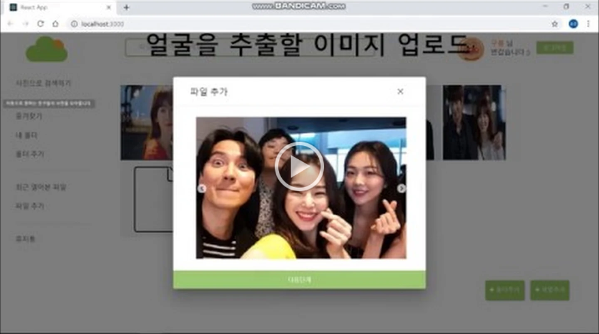
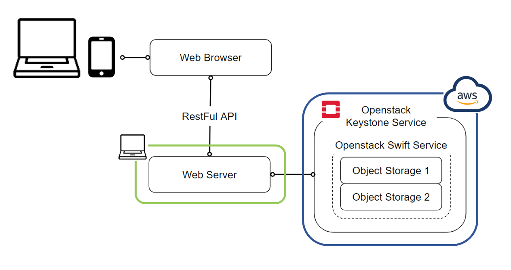
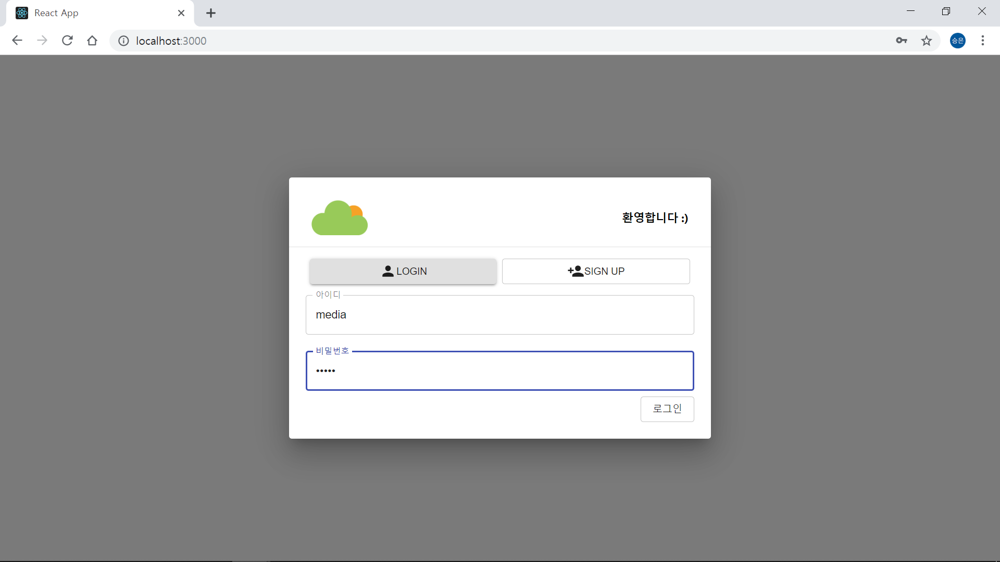
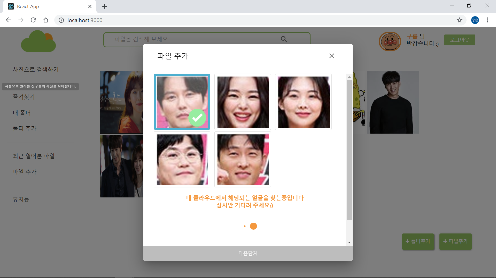
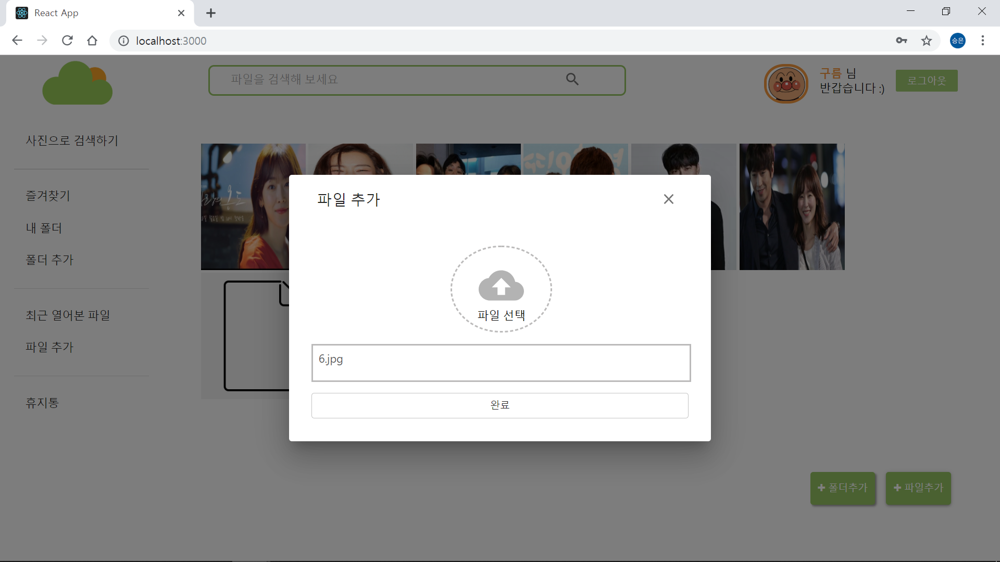

### MediaProject _ 얼구름

```
클라우드 스토리지 플랫폼을 구축하고 얼굴 인식과 비교를 통해 인물 사진 필터링 서비스를 제공하는 웹 앱 서비스 
```

#### 데모 영상  
[](https://drive.google.com/open?id=1Efzjk9d19lsHIHmHvJeEWnDCuM_a_7P_ "영상 링크")


#### Architecture



#### 웹 페이지 DEMO IMAGE





---
#### 최종 발표 PPT
[PPT 링크](https://drive.google.com/open?id=1mo6ohNDbKKQj5uMPDHTi4xmaiOnOMY8R)

#### CLOUD 관련 정리 : https://github.com/KwakSeungeun/Install_Openstack/tree/master/What%20_is_CLOUD

#### OPENSTACK 설치 가이드 : https://github.com/KwakSeungeun/Install_Openstack/tree/master/Install_OEPNSTACK 

#### 얼굴 인식 검색 관련 조사 : https://github.com/KwakSeungeun/Face_recognition.git 

